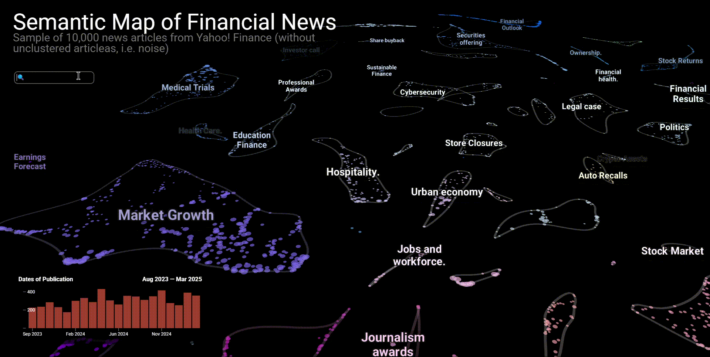
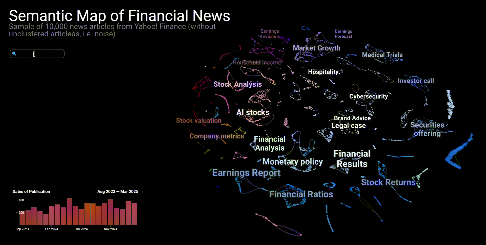

FinABYSS (Financial Aspect-Based Hybrid Semantic System)
---
- [Functionality](#functionality)
  - [Semantic Map](#semantic-map)
    - [💻 Install](#-install)
    - [🛠 How to Use](#-how-to-use)
  - [⭐️ Key Features](#️-key-features)
    - [Local \& Global Structure](#local--global-structure)
    - [Long Context](#long-context)
    - [Interactivity](#interactivity)
    - [Semantic Similarity](#semantic-similarity)
    - [Search for texts](#search-for-texts)
    - [Timeline infographic](#timeline-infographic)
    - [Sample word cloud](#sample-word-cloud)
  - [Predictor](#predictor)
- [Key dependencies](#key-dependencies)
- [Corpus of financial news articles](#corpus-of-financial-news-articles)
- [Notes](#notes)
  - [🚧 Future works](#-future-works)
  - [📍 Project Structure](#-project-structure)
  - [P.S.](#ps)

# Functionality
## Semantic Map
Семантическая карта может стать неотъемлемой частью рабочего процесса финансового аналитика, инвестора или кого-угодно еще, интересующегося финансами.

### 💻 Install
1. Just download [HTML file](semantic_map.html), right-click and open it in Microsoft Edge or Google Chrome (both gives the fastest response).
2. First, open the web-page and wait for it to fully load. You can determine whether the system is fully booted or not by the **pop-up windows when you hover over the dots**. If they pop up, the system is ready to function.
3. When the loading is complete, press the SHIFT key once. This is to speed up zooming in/out of the camera.

### 🛠 How to Use
* The map shows the **Dots**, each one a financial news article:
  * the **size** of the dot reflects the number of characters in the article;
  * the **color** of the dot corresponds to the main topic of the article.
  * when you hover over a dot, a **pop-up window** appears, containing the title of the news article, the tickers to which the article belongs, the original source of the article, as well as the time and date of publication;
  * **clicking** on the dot redirects to the original web-page of the article.
* A **Search Bar** is available in the upper right corner below the logo, implementing search functionality. The search is performed on all texts of articles.
* A **Histogram** is available in the lower right corner, which realizes the possibility of filtering news by time range. Each bar is a month. When you hover over a bar, all articles for the month are highlighted. To select the time range, you should click on the desired initial bar and drag the mouse to the expected end of the period.
* Along the left side is the **Filter Menu**. Cross-interaction of filters by three categories is allowed: Source, Topic, and Ticker. User can check the boxes of sources, topics and tickers that the user wants to find:
  * Since there are quite a few items in each category, a **Search Box** is available in each category.
  * After selecting items, the corresponding names are placed under the Search Box, from where they **can later be removed** by clicking on the cross.
* Semantic Map also offers functionality to build a **Word Cloud** for any group of articles. The word cloud is constructed from the texts of the highlighted articles. The user can select an arbitrary group of articles by pressing the SHIFT key and starting to circle the area of interest. After selecting the objects, the Word Cloud will appear on the left side of the Map. Once the Word Cloud is built, the user can immediately select another group. **To delete a Word Cloud, you must reset all filters and press the SHIFT key once**.

## ⭐️ Key Features
### Local & Global Structure
In the problem of dimensionality reduction, the **local structure refers to the dots and determines how accurately they are located relative to the nearest dots**. This absolutely true for our Smantic Map. Let's take a look at an example related to an Electric Vehicles cluster on a Semantic Map. After we have selected this cluster, we can see that it is somewhat fragmented, that is, it consists of several microclusters scattered over different parts of the map.


The subcluster in the lower right corner contains articles more about the safety of autonomous transport. If we look at the cluster on the left side of the map, which is adjacent to Mining Exploration, we can find that it's more about components such as lithium-ion batteries and electrical conductors for electrocars, which are usually made of gold. The same can be observed for the Cultural Tourism cluster, but in a more restrained form. Thus, mainland and island China can be observed in the upper part of the cluster, the Middle East from the bottom left, and South Asia on the bend.

Little differance lays in global structure that always determines as a represented variance of data. In our case, the **global structure mostly means the ability to continuously reflect a hierarchical structure**, that is, meso- and macro-clusters. It can be observed that such topical clusters as Hospitality Industry, Restaurant Industry, Alcohol Industry, Cannabis Industry, Cultural Tourism are quite close to each other, in fact forming the extended HoReCa industry.


The same can be observed with the clusters of National Security, Cryptocurrency Regulation and Cybersecurity.

So, on the Semantic Map, one can find some rather entertaining connections. For example, there is an area where the Electric Vehicle cluster is adjacent to the Mining Exploration, which we have been considering recently. If the word "lithium" is quite obvious, "gold" may surprise an unloaded user, however, the fact is that many times more gold is used for the production of electric cars than for cars with internal combustion engines. That is, the Semantic Map allows users who are not immersed in the specifics to discover rather deep inter-topic patterns.

### Long Context
### Interactivity
На интерактивной семантической карте нас встречают кластеры, представляющие темы. Каждая **точка является уникальной статьей**, при этом **размер точки указывает на относительную длину статьи**. Более того, каждую статью, мы можем с легкостью найти в Google (в дальнейшем переадресация будет доработана до прямой ссылки).


Итак, мы открываем статью, и во-первых видим насколько она большая — предыдущие модели не смогли бы обработать настолько длинный текст. И во-вторых диоксид углерода действительно упоминается в данной статье.

### Semantic Similarity
Как отмечалось ранее, данная карта достаточно хорошо сохраняет семантическую связь как кластеров, так и самих текстов между собой. Давайте посмотрим детальнее.


Мы видим группу кластеров, связанных со здравоохранением, все они располагаются кучно, но каждый является уникальным. Далее мы можем наблюдать, что *Sustainable Finance*, *Cybersecurity* и *Green Energy* тоже располагаются крайне близко. То же касается и *Politics* с *Monetary Policy*, но данные два кластера, имеют немного большую дистанцию, что вполне оправдано.

### Search for texts
Карта также предоставляет интерфейс к точечному обнаружению необходимых новостей по ключевым словам.



Так, Индонезию чаще всего можно встретить среди растущих рынков и политики, то же относится и к России, но Россия все же превалирует именно в политике.

### Timeline infographic
Что примечательно — мы можем **совмещать поиск по ключевым словам с распределением по датам** публикации или любым другим количественным признаком.



Так, мы можем наблюдать, что перед выборами в США, новостей о Трампе было меньше, чем после его победы. **Эта функция позволяет быстро и крайне просто выявлять исторические события и триггеры**.

### Sample word cloud
Наконец, самое интересное, что мы можем изучить, о чем говорят в новостях того или иного кластера, или просто выбранной группы.


Вполне резонно, что в *Sustainable Finance* чаще говорят об устойчивости, климате и углероде. Напротив, кластер с криптовалютой визуально подразделяется на два. В нижнем больше говорят о конкретных технологиях, а в верхнем скорее общеобразовательный контент на тему криптовалют.

## Predictor
Данная система вовсе не ограничивается лишь семантической картой, которая на самом деле представляет собой интепретируемый интерфейс к более закрытому процессу — прогнозированию стоимости финансовых активов с использованием тематических оценок тональностей.

# Key dependencies
- [Стилевое оформление ВКР](https://github.com/itonik/spbu_diploma/tree/master) с LaTeX-шаблоном для ВКР по ГОСТам;
- [BERTopic](https://github.com/MaartenGr/BERTopic);
- [alpha_vantage](https://github.com/RomelTorres/alpha_vantage);
- [PyTorch](https://github.com/pytorch/pytorch);
- [TensorBoard](https://pytorch.org/tutorials/recipes/recipes/tensorboard_with_pytorch.html) (доки по работе с PyTorch);
- [Polars](https://docs.pola.rs/) для ускорения работы с данными;
- [CUDA 12.1](https://developer.nvidia.com/cuda-toolkit) для ускорения обучения моделей;
- [cuML](https://docs.rapids.ai/api/cuml/stable/) для ускорения обучения моделей;

# Corpus of financial news articles
Датасет со всеми статьями расположен в [репозитории](https://huggingface.co/datasets/denisalpino/YahooFinanceNewsRaw) на HuggingFace.

# Notes
## 🚧 Future works
| Task                                                                           | Complexity | Priority | Current Status | Finished  |
|--------------------------------------------------------------------------------|------------|----------|----------------|-----------|
| Additional Corpus Cleaning                                                     | Easy       | High     | done           | &#x2611; Formalize rules
| Improve c-TF-IDF implementation                                                | Easy       | High     | done           | &#x2611; Configure MinimalMarginalRate from KeyBERT
| Improve Representation of Topics                                               | Normal     | High     | done           | &#x2611; Plug in the GPT-4o<br>&#x2611; Figure out how to account for the hierarchical structure
| Develop Hierarchical Structure Processing Logic Inspiring by BERTopic          | Normal     | Medium   | in progress    | &#x2611; Explore the BERTopic source code<br>&#x2610; Develop logic for assigning topic names to each level in the hierarchy
| Full-body Training                                                             | Normal     | High     | done           | &#x2611; Find and rent infrastructure with GPUs<br>&#x2611; Customize the environment<br>&#x2611; Adapt training code
| ModernBERT Domain Adaptive Pre-Training                                        | Hard       | High     | planning       | &#x2610; (optional) Expand the corpus<br>&#x2610; Find and rent infrastructure with GPUs<br>&#x2610; Write training code
| Evaluate and Compare ModernBERT & FinBERT (DAPT) on GLUE & FLUE benchmarks     | Hard       | High     | planning       | &#x2610; Find and gather all datasets from benchmarks<br>&#x2610; Write code to fine-tune for each of the tasks
| Refine the Semantic Map                                                        | Normal     | Medium   | planning       | &#x2610; Rework hover labels<br>&#x2610; Write custom code to build a word cloud using the native TF-IDF<br>&#x2610; Implement filtering by source<br>&#x2610; Improve the visual design<br>&#x2610; Develop more diverse infographics
| Refine the Text Search in the Semantic Map                                     | Normal     | Low      | planning       | &#x2610; Create the database for texts<br>&#x2610; Remove the texts from hover labels and migrate them into the database<br>&#x2610; Connect search system in the semantic map wit database
| Fine-tuning ModernBERT for Dense Embeddings                                    | Hard       | High     | planning       | &#x2610; ...
| Experimentation with Leiden Сlustering on kNN Graphs                           | Normal     | Low      | backlog        | &#x2610; ...
| Companys' Semantic Graph                                                       | Hard       | Low      | backlog        | &#x2610; ...
| Graph-based News Representation                                                | Hard       | Low      | backlog        | &#x2610; ...

## 📍 Project Structure
<details>
<summary>
FinABYSS
</summary>

```bash
├── data/
│   ├── preprocessed/
│   │   ├── articles.parquet
│   │   ├── embeddings_mp.npy
│   ├── raw/
│   │   ├── articles.parquet
│   │   ├── news_urls.parquet
│   │   └── ohlcv.parquet
│   └── sample/
│       ├── articles.parquet
│       ├── embeddings.npy
│       └── embeddings_l2.npy
├── docs/
│   └── ...
├── notebooks/
│   ├── 01_data_collecting/
│   │   ├── ohlcv.ipynb
│   │   └── yahoo_articles.ipynb
│   ├── 02_data_preprocessing/
│   │   ├── img/
│   │   │   ├── dark/
│   │   │   │   └── ...
│   │   │   └── light/
│   │   │       └── ...
│   │   ├── 01_articles_preprocessing.ipynb
│   │   ├── 02_articles_vizualization.ipynb
│   │   ├── 03_feature_extraction.ipynb
│   │   └── 04_data_sampling.ipynb
│   ├── 03_topic_modeling/
│   │   ├── img/
│   │   │   └── ...
│   │   ├── models/
│   │   │   ├── v1/
│   │   │   │   └── ...
│   │   │   ├── v2/
│   │   │   │   └── ...
│   │   │   ├── v3/
│   │   │   │   └── ...
│   │   │   └── summary.md
│   │   ├── 01_hpo.ipynb
│   │   ├── 02_topic_modeing.ipynb
│   │   ├── 03_model_analysis.ipynb
│   │   ├── 04_topic_vizualization.ipynb
│   │   └── tmp.ipynb
│   └── 04_semantic_map_dev/
│       ├── data/
│       │   └── ...
│       ├── semantic_map.ipynb
│       └── semantic_map_l2.html
├── paper/
│   ├── eng/
│   │   ├── img/
│   │   │   └── ...
│   │   ├── struct/
│   │   │   └── ...
│   │   ├── tab/
│   │   │   └── ...
│   │   ├── bibliography.bib
│   │   ├── main_eng.pdf
│   │   ├── main_eng.tex
│   │   └── preamble.tex
│   └── ru/
│       └── ...
├── parsers/
│   └── yahoo_parser.py
├── utils/
│   ├── api_key_manager.py
│   ├── custom_tqdm.py
│   ├── metrics.py
│   ├── proxy_manager.py
│   ├── pruner.py
│   └── vizualization.py
├── README.md
├── requirements.txt
└── semantic_map.html
```
</details>

## P.S.
