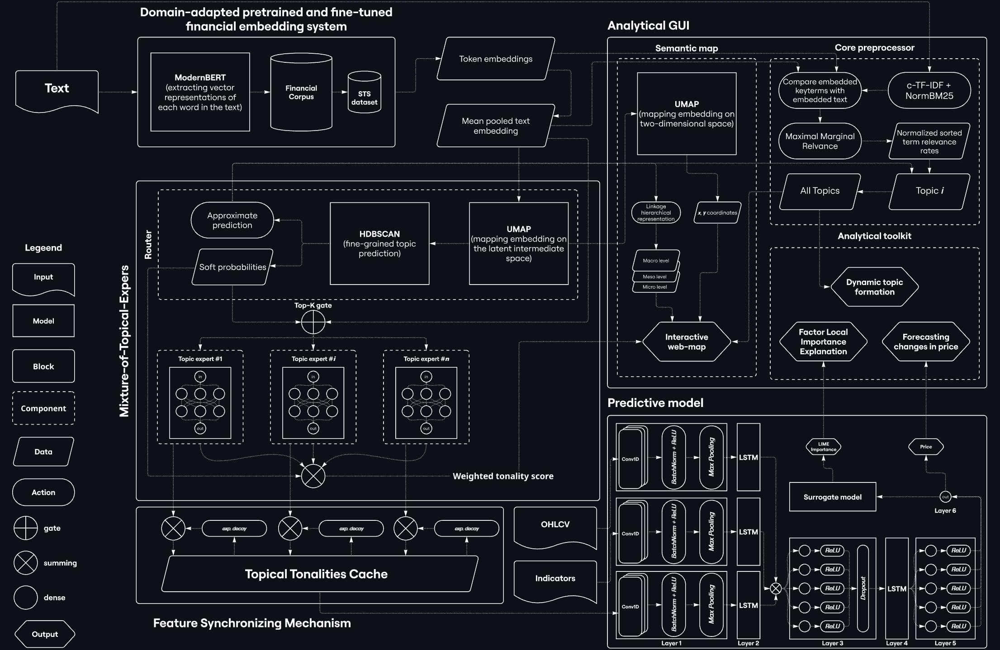
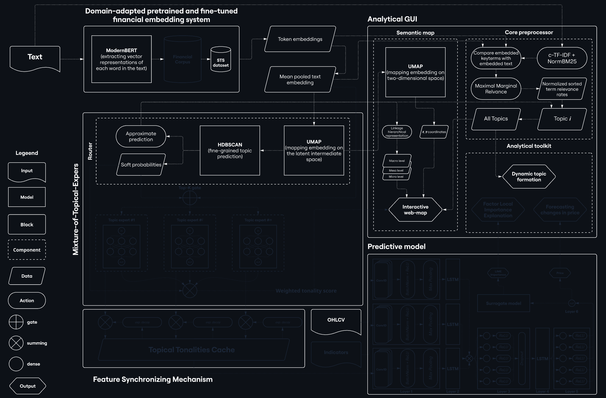
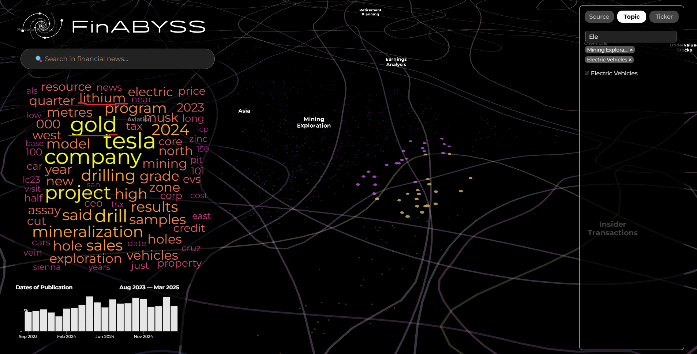

FinABYSS (Financial Aspect-Based Hybrid Semantic System)
---
- [🌏 Semantic Map](#-semantic-map)
  - [💻 Installation](#-installation)
  - [🛠 How to Use](#-how-to-use)
- [⚙️ Architecture](#️-architecture)
- [⭐️ Key Features](#️-key-features)
  - [🌀 Local \& Global Structure](#-local--global-structure)
  - [📚 Long Context](#-long-context)
  - [🚀 Speed up](#-speed-up)
- [Corpus of financial news articles](#corpus-of-financial-news-articles)
- [✍️ Notes](#️-notes)
  - [❗️ Key Dependencies](#️-key-dependencies)
  - [🌳 Project Structure](#-project-structure)
  - [🚧 Future Works](#-future-works)
  - [📞 Contacts](#-contacts)


This project aims to review the existing approach to financial forecasting and analysis, taking a step towards the analysis of multimodal data. We offer 2 key concepts:
1. Aspect-based sentiment analysis (ABSA), in the context of which aspects are considered as topics;
2. Considering financial sentiment as the strength and direction of information's influence on the price of a particular asset, rather than as an emotional coloring.

These assumptions have 3 key implications:
1. each document is represented by a set of topics from a predefined set without human involvement;
2. each publication has $k$ sentiments corresponding to each topic;
3. sentiments of one publication will vary depending on the asset.

# 🌏 Semantic Map
Семантическая карта может стать неотъемлемой частью рабочего процесса финансового аналитика, инвестора или кого-угодно еще, интересующегося финансами.

## 💻 Installation
1. Just download [HTML file](semantic_map.html), right-click and open it in Microsoft Edge or Google Chrome (both gives the fastest response).
2. First, open the web-page and wait for it to fully load. You can determine whether the system is fully booted or not by the **pop-up windows when you hover over the dots**. If they pop up, the system is ready to function.
3. When the loading is complete, press the SHIFT key once. This is to speed up zooming in/out of the camera.

## 🛠 How to Use
* The map shows the **Dots**, each one a financial news article:
  * the **size** of the dot reflects the number of characters in the article;
  * the **color** of the dot corresponds to the main topic of the article.
  * when you hover over a dot, a **pop-up window** appears, containing the title of the news article, the tickers to which the article belongs, the original source of the article, as well as the time and date of publication;
  * **clicking** on the dot redirects to the original web-page of the article.
* A **Search Bar** is available in the upper right corner below the logo, implementing search functionality. The search is performed on all texts of articles.
* A **Histogram** is available in the lower right corner, which realizes the possibility of filtering news by time range. Each bar is a month. When you hover over a bar, all articles for the month are highlighted. To select the time range, you should click on the desired initial bar and drag the mouse to the expected end of the period.
* Along the left side is the **Filter Menu**. Cross-interaction of filters by three categories is allowed: Source, Topic, and Ticker. User can check the boxes of sources, topics and tickers that the user wants to find:
  * Since there are quite a few items in each category, a **Search Box** is available in each category.
  * After selecting items, the corresponding names are placed under the Search Box, from where they **can later be removed** by clicking on the cross.
* Semantic Map also offers functionality to build a **Word Cloud** for any group of articles. The word cloud is constructed from the texts of the highlighted articles. The user can select an arbitrary group of articles by pressing the SHIFT key and starting to circle the area of interest. After selecting the objects, the Word Cloud will appear on the left side of the Map. Once the Word Cloud is built, the user can immediately select another group. **To delete a Word Cloud, you must reset all filters and press the SHIFT key once**.


# ⚙️ Architecture

Данная система вовсе не ограничивается лишь семантической картой, которая на самом деле представляет собой интепретируемый интерфейс к более закрытому процессу — прогнозированию стоимости финансовых активов с использованием тематических оценок тональностей.





# ⭐️ Key Features
## 🌀 Local & Global Structure
This map preserves the semantic relationship of both the clusters and the texts themselves to each other quite well. In the problem of dimensionality reduction, the **local structure refers to the dots and determines how accurately they are located relative to the nearest dots**. This absolutely true for our Semantic Map. Let's take a look at an example related to an Electric Vehicles cluster on a Semantic Map. After we have selected this cluster, we can see that it is somewhat fragmented, that is, it consists of several microclusters scattered over different parts of the map.


The subcluster in the lower right corner contains articles more about the safety of autonomous transport. If we look at the cluster on the upper right side of the map, we can find that it's more about Europe vehicles industry. The same can be observed for the Cultural Tourism cluster, but in a more restrained form. Thus, mainland and island China can be observed in the upper part of the cluster, the Middle East from the bottom left, and South Asia on the bend.

Little differance lays in global structure that always determines as a represented variance of data. In our case, the **global structure mostly means the ability to continuously reflect a hierarchical structure**, that is, meso- and macro-clusters. It can be observed that such topical clusters as Hospitality Industry, Restaurant Industry, Alcohol Industry, Cannabis Industry, Cultural Tourism are quite close to each other, in fact forming the extended HoReCa industry.


The same can be observed with the clusters of National Security, Cryptocurrency Regulation and Cybersecurity.

So, on the Semantic Map, one can find some rather entertaining connections. For example, there is an area where the Electric Vehicle cluster is adjacent to the Mining Exploration, which we have been considering recently. If the word "lithium" is quite obvious, "gold" may surprise an unloaded user, however, the fact is that many times more gold is used for the production of electric cars than for cars with internal combustion engines. That is, the Semantic Map allows users who are not immersed in the specifics to discover rather deep inter-topic patterns.



Another version of the Semantic Map is also available (PaCMAP-based), which, unlike the current one, prioritizes the global structure, but makes it difficult to trace local relationships.

## 📚 Long Context

Previously, the `BERT` model or its improved versions were most commonly used for embedding tasks, but all were limited to contexts of 512 tokens, which did not allow processing long texts. Sliding contex window type methods are costly and lose long term contextual relationships.

This project focuses on "budget" LMs designed to extract embeddings from long texts. The current solution is based on [`gte-modernbert-base`](https://huggingface.co/Alibaba-NLP/gte-modernbert-base), which can handle up to 8192 tokens. However, this is still not enough, so in the near future it is planned to switch to the newly released [`Qwen3-Embedding-4B`](https://huggingface.co/Qwen/Qwen3-Embedding-4B), which is capable of processing up to 32k tokens.

Thus, the current solution allows us to reach a **new level** — to process not only short posts in social networks and news headlines, but also press releases, news, transcripts of financial events and much more.

## 🚀 Speed up
* Embedding Extraction — 9 times
* Models training (UMAP & HDBSCAN) — 80 times

# Corpus of financial news articles
Датасет со всеми статьями расположен в [репозитории](https://huggingface.co/datasets/denisalpino/YahooFinanceNewsRaw) на HuggingFace.

# ✍️ Notes

## ❗️ Key Dependencies

To reproduce the experiments, you need to create `Python 3.10` environment in which all the dependencies from `requirements.txt`, as well as `CUDA 12.1` and `cuML 25.06.00` for UMAP and HDBSCAN training. Core dependencies include:
- [`BERTopic`](https://github.com/MaartenGr/BERTopic) — a convenient API for vizualizing generated topics, working with topic texts, and hierarchical structure;
- [`PyTorch`](https://github.com/pytorch/pytorch) — to speed up the process of embedding extraction and mean pooling;
- [`Transformers`](https://github.com/huggingface/transformers) & [`SBERT`](https://sbert.net/) — to speed up the process of embedding extraction and mean pooling;
- [`alpha_vantage`](https://github.com/RomelTorres/alpha_vantage) — API for collecting minute-long OHLCV data;
- [`Polars`](https://docs.pola.rs/) — for lazy data preprocessing.


## 🌳 Project Structure
<details>
<summary>
FinABYSS
</summary>

```bash
├── data/
│   ├── preprocessed/
│   │   ├── articles.parquet    # Fully preprocessed articles by texts and its metadata
│   │   ├── embeddings_mp.npy   # Mean pooled embeddings for each article in the corpus
│   ├── raw/
│   │   ├── articles.parquet    # Parsed news articles with their metadata
│   │   ├── news_urls.parquet   # Scrapped urls leading to rhe news pages on Yahoo! Finance
│   │   └── ohlcv.parquet
│   └── sample/                 # Training sample of 126.000 articles + their embeddings
│       ├── articles.parquet
│       ├── embeddings.npy
│       └── embeddings_l2.npy
├── docs/                       # Images and gifs for README
├── notebooks/
│   ├── 01_data_collecting/     # Data collecting pipelines
│   │   ├── ohlcv.ipynb
│   │   └── yahoo_articles.ipynb
│   ├── 02_data_preprocessing/  # Data prep, viz, feature extraction and sampling pipelines
│   │   ├── img/
│   │   ├── 01_articles_preprocessing.ipynb
│   │   ├── 02_articles_vizualization.ipynb
│   │   ├── 03_feature_extraction.ipynb
│   │   └── 04_data_sampling.ipynb
│   ├── 03_topic_modeling/
│   │   ├── img/                # Images from model analysis and topic viz (L2-based model)
│   │   ├── models/
│   │   │   ├── v1/             # Exploratory first version of topic model
│   │   │   ├── v2/             # Topic model based on L2-Euclidean dist metric
│   │   │   ├── v3/             # Topic model based on Cosine & Euclidean dist metrics
│   │   │   └── summary.md
│   │   ├── 01_hpo.ipynb
│   │   ├── 02_topic_modeing.ipynb
│   │   ├── 03_model_analysis.ipynb
│   │   └── 04_topic_vizualization.ipynb
│   └── 04_semantic_map_dev/
│       ├── data/                # Embeddings from the intermediate space and 2D + labels
│       ├── semantic_map.ipynb   # HTML/CSS/JS + Python wrapper for Semantic Map
│       └── semantic_map_l2.html # Semantic Map based on L2-Euclidean dist metric
├── paper/
│   ├── eng/    # English thesis with bibliography and LaTeX
│   └── ru/     # Russian version of thesis (badly adapted)
├── parsers/    # Still class for parsing URLs and news from only Yahoo! Finance
├── utils/
│   ├── api_key_manager.py     # API-key rotator class
│   ├── custom_tqdm.py         # TQDM-wrapper for monitoring parsing process
│   ├── metrics.py             # Metrics for HPO (finally unused)
│   ├── proxy_manager.py       # Proxy-rotator for parsing articles
│   ├── pruner.py              # 3 pruners for HPO with Optuna
│   └── vizualization.py       # Functions for viz parallel coordinates & feature importance
├── README.md
├── requirements.txt
└── semantic_map.html # Main Semantic Map based on Cosine + Euclidean dist metric
```
</details>

## 🚧 Future Works
| Task                                                                           | Complexity | Priority | Current Status | Finished  |
|--------------------------------------------------------------------------------|------------|----------|----------------|-----------|
| ~~Additional Corpus Cleaning~~                                                     | Easy       | High     | done           | &#x2611; Formalize rules
| ~~Improve c-TF-IDF implementation~~                                                | Easy       | High     | done           | &#x2611; Configure MinimalMarginalRate from KeyBERT
| ~~Improve Representation of Topics~~                                               | Normal     | High     | done           | &#x2611; Plug in the GPT-4o<br>&#x2611; Figure out how to account for the hierarchical structure
| ~~Develop Hierarchical Structure Processing Logic Inspiring by BERTopic~~          | Normal     | Medium   | in progress    | &#x2611; Explore the BERTopic source code<br>&#x2611; Develop logic for assigning topic names to each level in the hierarchy
| Full-body Training (all corpus)                                                             | Normal     | High     | done           | &#x2610; Find and rent infrastructure with GPUs<br>&#x2610; Customize the environment<br>&#x2610; Adapt training code
| ModernBERT Domain Adaptive Pre-Training                                        | Hard       | High     | planning       | &#x2610; (optional) Expand the corpus<br>&#x2610; Find and rent infrastructure with GPUs<br>&#x2610; Write training code
| Evaluate and compare ModernBERT (DAPT) & FinBERT on GLUE & FLUE benchmarks     | Hard       | High     | planning       | &#x2610; Find and gather all datasets from benchmarks<br>&#x2610; Write code to fine-tune for each of the tasks
| ~~Refine the Semantic Map~~                                                        | Normal     | Medium   | done       | &#x2611; Rework hover labels<br>&#x2611; Write custom code to build a word cloud using the native TF-IDF<br>&#x2611; Implement filtering by source<br>&#x2611; Improve the visual design<br>&#x2611; Develop more diverse infographics
| Refine the Text Search in the Semantic Map                                     | Normal     | Low      | planning       | &#x2610; Create the vector DB (FAISS) for texts<br>&#x2611; Remove the texts from hover labels and migrate them into the database<br>&#x2610; Connect search system in the semantic map wit database
| Fine-tuning ModernBERT (DAPT) for Dense Embeddings                                    | Hard       | High     | planning       | &#x2610; ...
| Experimentation with Leiden Сlustering on kNN Graphs                           | Normal     | Low      | backlog        | &#x2610; ...
| Companys' Semantic Graph                                                       | Hard       | Low      | backlog        | &#x2610; ...
| Graph-based News Representation                                                | Hard       | Low      | backlog        | &#x2610; ...

## 📞 Contacts

Email: denis.tomin.alpino@gmail.com

Telegram: [@denisalpino](https://t.me/denisalpino)